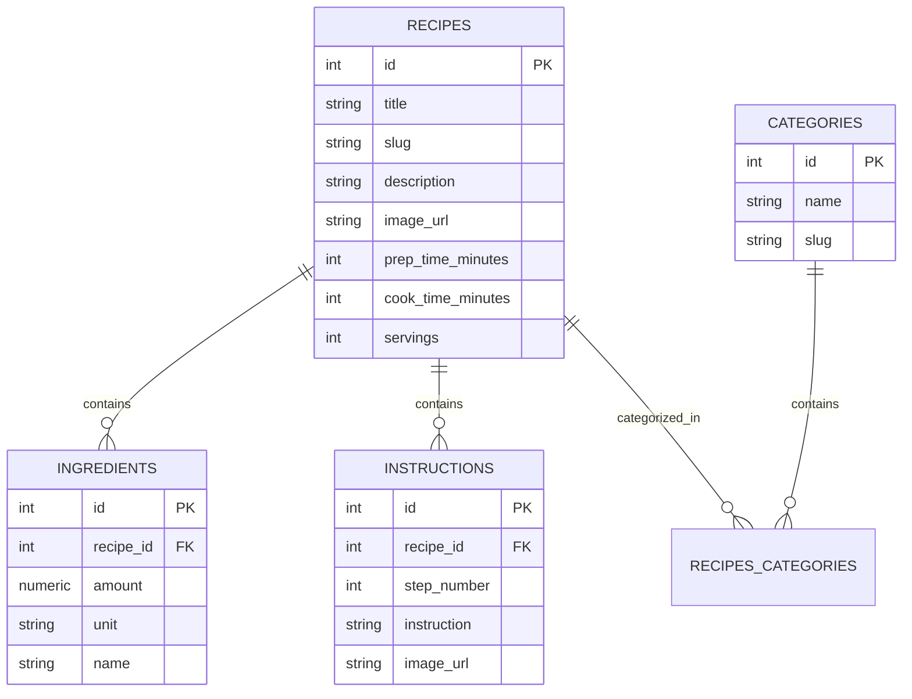

# Web Application Architecture & Structure (`/web`)

This document provides a comprehensive overview of the frontend web application architecture, directory structure, component hierarchy, routing system, and design conventions.

---

## 1. Tech Stack Overview

- **Framework**: Next.js 16 (App Router with Turbopack)
- **Language**: TypeScript (`ES2022`, strict mode)
- **UI Library**: React 19 (Server & Client Components)
- **Styling**: Tailwind CSS v4 + Custom Design Tokens (`globals.css`)
- **Typography**: 
  - Headline / Display: **Plus Jakarta Sans** (`--font-headline`)
  - Body / Long-form: **Be Vietnam Pro** (`--font-body`)
- **Icons**: Material Symbols Outlined
- **Data Source**: Local mock database matching PostgreSQL schema (`src/data/mockData.ts`)

---

## 2. Directory Tree

```text
web/
├── app/
│   ├── (site)/                       # Public Consumer Site Route Group
│   │   ├── layout.tsx                # Public layout (Navbar + Content + Footer)
│   │   ├── page.tsx                  # Home / Discover recipes page
│   │   └── recipes/
│   │       └── [slug]/
│   │           └── page.tsx          # Dynamic Recipe Detail page (SSG)
│   ├── admin/                        # Admin Portal
│   │   ├── components/
│   │   │   └── AdminSidebar.tsx      # Responsive navigation sidebar & mobile drawer
│   │   ├── layout.tsx                # Admin portal layout shell
│   │   ├── page.tsx                  # Admin Dashboard (Stats + Recent Recipes)
│   │   └── recipes/
│   │       └── create/
│   │           └── page.tsx          # 3-Step Recipe Creation Wizard
│   ├── components/                   # Shared Consumer Components
│   │   ├── Footer.tsx                # Global footer with brand & links
│   │   ├── Navbar.tsx                # Sticky top navigation bar & CTA
│   │   ├── RecipeActions.tsx         # Favorite (localStorage) & Web Share actions
│   │   ├── RecipeListing.tsx         # Client component: search, category pills & grid
│   │   └── ServingScaler.tsx         # Dynamic serving size & ingredient scaler
│   ├── favicon.ico                   # App icon
│   ├── globals.css                   # Tailwind CSS v4 directives, tokens & custom utilities
│   └── layout.tsx                    # Root HTML/Body layout & font configuration
├── public/                           # Static assets
│   ├── images/                       # Recipe photography
│   ├── file.svg
│   ├── globe.svg
│   ├── next.svg
│   ├── vercel.svg
│   └── window.svg
├── src/
│   └── data/
│       └── mockData.ts               # Domain interfaces, dataset, and query helper functions
├── DESIGN.md                         # Design system specifications (Stitch project tokens)
├── STRUCTURE.md                      # Architecture & directory documentation (this file)
├── eslint.config.mjs                 # ESLint configuration
├── next.config.ts                    # Next.js configuration
├── package.json                      # Dependencies and scripts
├── postcss.config.mjs                # PostCSS plugins
└── tsconfig.json                     # TypeScript compiler configuration
```

---

## 3. Architecture & Routing Strategy

The application uses Next.js App Router with separated route segments for the **Public Consumer Site** and the **Admin Management Portal**.

```text
RootLayout (app/layout.tsx)
 ├── (site) Route Group (app/(site)/layout.tsx)  -->  Navbar + Content + Footer
 │    ├── /                                      -->  Home / Discover (app/(site)/page.tsx)
 │    └── /recipes/[slug]                        -->  Recipe Detail (app/(site)/recipes/[slug]/page.tsx)
 └── admin Route Segment (app/admin/layout.tsx)   -->  AdminSidebar + Content Shell
      ├── /admin                                 -->  Admin Dashboard (app/admin/page.tsx)
      └── /admin/recipes/create                  -->  3-Step Wizard (app/admin/recipes/create/page.tsx)
```

### Route Summary

| Route Path | Type | Rendering Strategy | Description |
|---|---|---|---|
| `/` | Public | Client Component (`RecipeListing`) inside Server Page | Searchable recipe listing with category filters and cards. |
| `/recipes/[slug]` | Public | Server Component (`generateStaticParams`) | Full recipe detail with hero image, scaling ingredients, and instruction steps. |
| `/admin` | Admin | Server Component | Analytics stats bento grid and recipe management table. |
| `/admin/recipes/create` | Admin | Client Component | 3-step interactive recipe builder (Basic Info, Ingredients & Steps, Review & Publish). |

---

## 4. Component Responsibilities

### Public Components (`app/components/`)

- **[Navbar.tsx](file:///Users/kiennt2/recipes/web/app/components/Navbar.tsx)**:
  - Sticky glassmorphic header (`bg-[#faf9f5]/80 backdrop-blur-md`).
  - Brand link (*Bếp Nhà Phương*), main navigation links (*Khám Phá*, *Bảng Quản Trị*, *Kế Hoạch Bữa Ăn*), and quick creation CTA button.
- **[Footer.tsx](file:///Users/kiennt2/recipes/web/app/components/Footer.tsx)**:
  - Rounded container footer (`rounded-t-[32px] bg-[#e9e8e4]`) with brand statement, copyright, and social/policy navigation.
- **[RecipeListing.tsx](file:///Users/kiennt2/recipes/web/app/components/RecipeListing.tsx)** (`"use client"`):
  - Manages real-time search filtering across titles and descriptions.
  - Horizontally scrollable category filter pills with active state indicators.
  - Responsive recipe cards with badges, thumbnails, description clamps, and preparation times.
- **[ServingScaler.tsx](file:///Users/kiennt2/recipes/web/app/components/ServingScaler.tsx)** (`"use client"`):
  - Interactive stepper to increase/decrease serving quantities (1–24).
  - Automatically calculates and formats scaled ingredient amounts.
  - Interactive checklist allowing users to check off ingredients as they cook.
- **[RecipeActions.tsx](file:///Users/kiennt2/recipes/web/app/components/RecipeActions.tsx)** (`"use client"`):
  - Client-side favorite toggle persisted via `localStorage` with `useSyncExternalStore`.
  - Native Web Share API integration with clipboard fallback.

### Admin Components (`app/admin/components/`)

- **[AdminSidebar.tsx](file:///Users/kiennt2/recipes/web/app/admin/components/AdminSidebar.tsx)** (`"use client"`):
  - Desktop fixed sidebar (256px wide) with active route detection, brand heading, navigation items, CTA button, and user profile snippet.
  - Mobile top bar with notification button and toggleable full-screen drawer menu.

---

## 5. Data Architecture (`src/data/mockData.ts`)

The data layer mimics the backend PostgreSQL database schema (`api/db/schema.sql`):



### Data Access Helpers
- `getRecipesWithCategories()`: Aggregates recipes joined with their assigned category objects.
- `getRecipeWithDetails(slug)`: Retrieves a single recipe with all associated ingredients, instruction steps, and categories.

---

## 6. Styling & Design System (`app/globals.css`)

The styling follows the **Delicious Pop** design tokens from Google Stitch:

### Key Color Tokens
- **Primary Accent (`Coral Punch`)**: `#ff6b6b` / `#ae2f34`
- **Secondary Accent (`Mustard`)**: `#ffd167` / `#785a00`
- **Success / Freshness (`Mint`)**: `#00b083` / `#006c4f`
- **Surface & Backgrounds**: `#faf9f5` (Canvas), `#ffffff` (Cards), `#efeeea` (Containers), `#e3e2df` (Borders)
- **Text**: `#1b1c1a` (Headline/Primary), `#584140` (Body/Secondary), `#8c706f` (Muted/Captions)

### Custom Utilities
- `.btn-coral-punch`: Tactile button with subtle 3D shadow press effect.
- `.btn-outline`: Clean bordered button with hover lift.
- `.vibrant-input`: Uniform input/select/textarea styling with focus rings.
- `.shadow-floating`, `.shadow-ambient-low`: Soft ambient layered elevation shadows.
- `.bouncy-hover`: Micro-interaction scale on card hover.

---

## 7. Development & Build Commands

```bash
# Start development server with Turbopack (http://localhost:3000)
npm run dev

# Build production bundle and validate TypeScript/ESLint
npm run build

# Start production server
npm start

# Run ESLint linter
npm run lint
```
